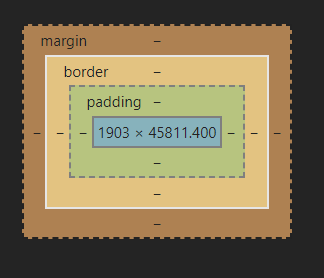

# css {ignore}

---

[toc]

## css代码引入

~~~html

方式1
在head标签中写入
 
方式2
在标签中写入

div标签

方式3
外部文件引入
在head标签里写link标签
<link rel="stylesheet" href="1.css">
css文件中写style标签内的内容
~~~

## css选择器

### 基本选择器

匹配对象：

~~~html

<a>aa</a>

<a>456</a>
~~~

~~~css

元素选择器  #匹配指定的标签
    标签名{css属性:属性值;}
    div{background:red;}

id选择器    #匹配id值符合的标签
    #id值{css属性:属性值;}
    #c1{background:red;}

类选择器    #匹配类值符合的标签
    .class值{css属性:属性值;}
    .c2{background:red;}

通用选择器  #匹配所有标签
    *{css属性:属性值;}

~~~

### 组合选择器

**确认选择器**(匹配选择器1并符合选择器2的标签)

~~~css

选择器1选择器2{css属性:属性值;}
div#c1{background:red;}
~~~

**后代选择器**(匹配选择器1的后代中所有符合选择器2的标签)

~~~css

选择器1 选择器2{css属性:属性值;}  
div a{background:red;}
~~~

**儿子选择器**(匹配选择器1的子标签中所有符合选择器2的标签)

~~~css

选择器1>选择器2{css属性:属性值;}
div>a{background:red;}
~~~

**毗邻选择器**(匹配选择器1的下一个兄弟标签中符合选择器2的标签)

~~~css

选择器1+选择器{css属性:属性值;}
div+a{background:red;}
~~~

**弟弟标签**(匹配选择器1之后的兄弟标签中符合选择器2的标签)

~~~css

选择器1~选择器2{css属性:属性值;}
div~a{background:red;}
~~~

### 属性选择器

~~~css

通过属性名匹配
[属性名]{css属性:属性值;}
[href]{background:red;}

通过属性名与对应的值匹配
[属性名=属性值]{css属性:属性值;}
[id="c1"]{background:red;}
~~~

### 分组

~~~css

选择器1,选择器2...{css属性:属性值;}
div,a{background:red;}
~~~

### 伪类选择器

~~~css

/* a标签未访问 */
a:link{color:red;}

/* a标签已访问 */
a:visited{color:green;}

/* 鼠标移动的某标签上 */
a:hover{color:green;}

/* 点下某标签 */
a:active{color:red}

/* input标签输入框取得焦点 */
input:focus{background-color:pink;}
~~~

### 伪元素选择器

~~~css

/* 文本第一个字符 */
a:first-letter{color: red;}

/* 标签内容前插入内容 */
a:before{content:"文本前加的内容"}

/* 标签内容后插入内容 */
a:after{content:"文本后加的内容"}
~~~

通过伪类选择器在内容添加的文本是无法选中的

### 选择器的优先级

选择器|优先及
--|---:|
id选择器|100|
继承|0|
类选择器|10|
元素选择器|1|
在标签中填写|10000|
在属性值后跟！important|最大

(**优先级不会进位**)

## CSS属性

~~~css

width: 100px;   #宽度
height: 100px;  #高度
background-color:red ;  #背景颜色

~~~

宽度高度设置只有块级标签才可以设置，内敛标签的高度和宽度由内容决定
a标签内的css样式要定位到a标签上才生效

### 字体属性

~~~css

font-family: '楷体';    #字体（属性值可以写对应字体）
color: black;   #字体颜色
font-sizepx:14px;   #字体大小（默认为16px）
font-weight: bold;   #字体粗细
~~~

字体粗细值|描述|
--|--|
normal|默认，标准|
bold|粗体|
bloder|更粗|
lighter|更细|
100~900|由细到粗，400=默认|

~~~css

text-align: right;  #字体对齐
~~~

值|说明|
--|--|
left|左对齐 默认|
right|右对齐|
center|居中|

~~~css

text-decoration:none;   #下划线
~~~

值|描述|
--|--|
none|取消|
underline|下划线|
overline|上划线|
line-through|删除线|

~~~css

text-indent: 32px;  #首行缩进，一个字大小默认16px
~~~

### 背景颜色

~~~css

background：red url('图片路径') no-repeat right top
颜色 图片路径 是否平铺 图片位置
~~~

- 颜色的四种写法:
  - 直接写颜色名称：red、black
  - rgb：rgb(255,255,255)
  - 16进制：#ff2525
    - 可以简写位#f2525两位相同可以缩写
  - rgba:rgba(255,255,255,0.5)
    - 最后一位为透明度

平铺值|描述|
--|--|
no-repeat|不平铺|
reperat|平铺 默认|

图片位置两种写法：

1. 具体位置：10px 20px / 距右边距离 距上面距离
2. 方位描述: top center bottom /上 中 下
left center right / 左 中 右

### 边框样式

~~~css

border-width: 10px;
border-style: dotted;
border-color: red;
简写:
border: 宽度 样式 颜色;
border: 2px dotted red;
~~~

样式值|描述|
--|--|
none|无边框|
dotted|点状虚边框|
dashed|矩形虚边框|
solid|实线边框|

还可单独设置某一边边框，例如：

~~~css

dorder-top-color: black;
dorder-left-style：none;
dorder-top: 2px dotted red;
~~~

~~~css

border-radius: 50%; #控制圆角
~~~

### display属性/标签类型转换

~~~css

display: inline-block   #设置标签同时具备块级标签与内敛标签的特性
~~~

display值|描述|
--|--|
none|设置标签隐藏，而且不占据位置|
hidden|设置标签隐藏，但是保留原来的位置
block|设置标签为块级标签|
inline|设置标签为内敛标签|
inline-block|设置标签同时具备内敛标签与块级标签特性，可以设置高度与宽度,而且不占据一行|

### CSS盒子模型

margin(外边距)：控制元素与元素之间的距离
border(边框)：围绕在内容与内边框外的边框
padding(内边框)：用于控制内容与边框的距离
content(内容)：盒子模型的内容，显示文字和图像

~~~css

内外边距均可使用
padding: 10px 20px 30px 40px;   上右下左
margin-top: 10px;
~~~

### float浮动

~~~css

float: left;   #浮动向左
~~~

float值|描述|
--|--|
left|向左浮动|
right|向右浮动|
none|不浮动 默认|

浮动会挤压不浮动的元素，并且可能会导致父级标签塌陷

~~~css

为处理浮动导致父级标签塌陷问题一般只用该方法：（使用伪类选择器在塌陷的父标签后添加一个空内容，并且设置取消浮动，与块级标签。
在标签浮动后，空内容被挤到最后，但由于是空内容所以没有高度，父标签被撑起浮动标签的高度）
.clearfix:after{
    content:"";
    display:block;
    clear:both;
}
~~~

clear值|描述|
--|--|
left|左侧不允许有浮动元素|
right|右侧不允许有浮动元素|
both|左右两侧不允许有浮动元素|
none|允许浮动 默认值|

### overflow溢出属性

~~~css

overflow: scroll;   #内容显示超过标签大小时设置
~~~

overflow值|描述|
--|--|
visible|不修剪，内容会呈现在元素框外|
hidden|会修剪显示的内容|
auto|如果有修剪，显示滚动条|

### 定位position

~~~css

定位均使用top、left、right、bottom来设置距离

相对定位
position: relative；    #相对定位，保留原来的空间位置，相对自己原来的位置移动

绝对定位
position: absolute;     #绝对定位，不保留自己原来的位置，依据父级或祖先级标签设置里相对定位的位置来进行设置，如果一直没有，就依据body标签位置

固定定位
position: fixed;        #固定点位，不保留自己原来的位置，通过相对浏览器窗口距离来设置位置距离
~~~

### z-index图层属性

~~~css

z-index: 99;    #设置图层，数值越大，越在上面
~~~

只有定位的标签可以设置z-index，浮动标签能使用，父级标签如果被压着，子标签图层设置再大也压不回去

### opacity透明度属性

~~~css

opacity: 0.3;   #整个标签的透明度，0~1，越小越透明

~~~
