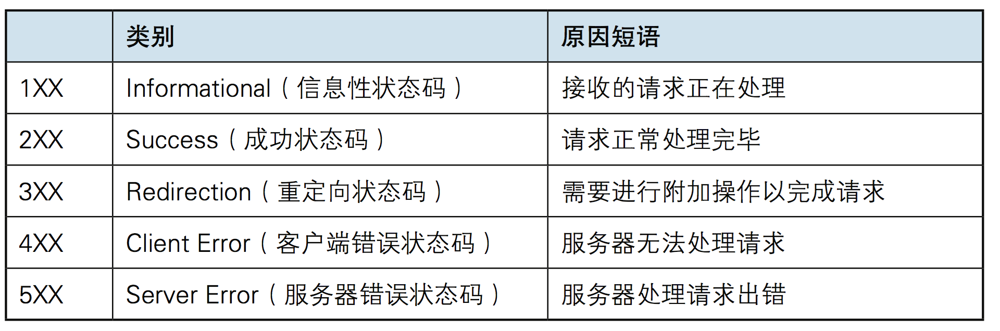
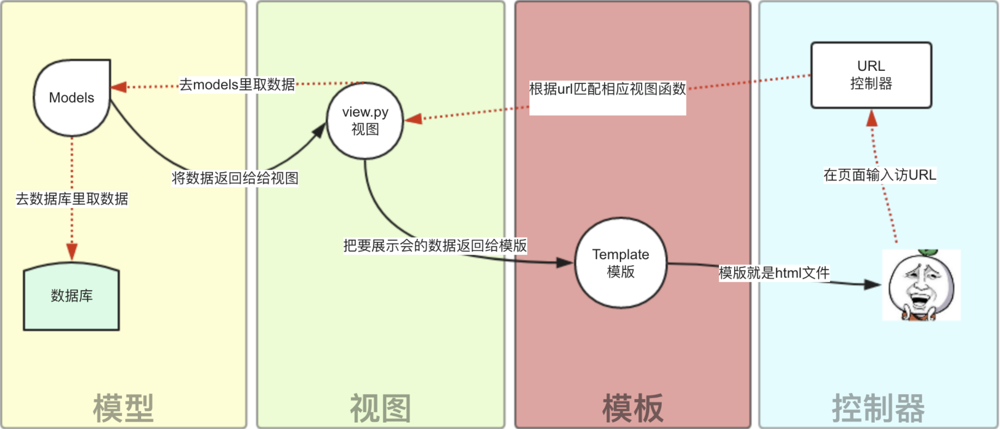
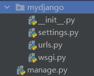

# django {ignore}

[toc]

---

## web框架本质

使用socket简单实现web框架功能

~~~python

import socket
sk = socket.socket()
sk.bind(('127.0.0.1',8001))
sk.listen()
conn,addr = sk.accept()
from_b_msg = conn.recv(1024)
str_msg = from_b_msg.decode('utf-8')
conn.send(b'HTTP/1.1 200 ok \r\n\r\n')
conn.send(b'hello')
~~~

### http请求(request)格式

请求方式：

1. GET：    向指定的资源发出“显示”请求

2. HEAD：   与GET方法一样，都是向服务器发出指定资源的请求。只不过服务器将不传回资源的本文部分（只返回文件的head标签内的内容）

3. POST：    向指定资源提交数据，请求服务器进行处理（例如提交表单或上传文件）。传输的数据在请求文本中

4. PUT：    向指定资源位置上传其最新内容

5. DELETE： 请求服务器删除指定资源

6. TRACE：  回显服务器收到的请求，主要用于测试或诊断

7. OPTIONS：    这个方法可以使服务器传回该资源所支持的所有HTTP请求方法。用'*'来代替资源名称，向Web服务器发送OPTIONS请求，可以测试服务器功能是否正常运作。

8. CONNECT：    HTTP/1.1协议中预留给能够将链接改为管道方式的代理服务器。通常用于SSL加密服务器的链接（经由非加密的HTTP代理服务器）。

示例：

~~~http

GET / HTTP/1.1
Host: 127.0.0.1:8001
Connection: keep-alive
Upgrade-Insecure-Requests: 1
Upgrade-Insecure-Requests: 1
User-Agent: Mozilla/5.0 (Windows NT 10.0; Win64; x64) AppleWebKit/537.36 (KHTML, like Gecko) Chrome/86.0.4240.111 Safari/537.36
Accept: text/html,application/xhtml+xml,application/xml;q=0.9,image/avif,image/webp,image/apng,*/*;q=0.8,application/signed-exchange;v=b3;q=0.9
Sec-Fetch-Site: none
Sec-Fetch-Mode: navigate
Sec-Fetch-User: ?1
Sec-Fetch-Dest: document
Accept-Encoding: gzip, deflate, br
Accept-Language: zh,zh-TW;q=0.9,en-US;q=0.8,en;q=0.7,zh-CN;q=0.6
Cookie: csrftoken=wbpwiMbku4CIpXWMAb8KiTudh2gPKHC9eaMjnriN4fFSP6dcgRuXwS27GH3eYKtp
~~~

### http响应(response)格式

响应状态码

### URL

超文本传输协议（HTTP）的统一资源定位符将从因特网获取信息的五个基本元素包括在一个简单的地址中：

* 传输协议

* 层级URL标记符号(为[//],固定不变)

* 服务器。（通常为域名，有时为IP地址）

* 端口号。（以数字方式表示，若为HTTP的默认值“:80”可省略）

* 路径。（以“/”字符区别路径中的每一个目录名称）

* 查询。（GET模式的窗体参数，以“?”字符为起点，每个参数以“&”隔开，再以“=”分开参数名称与数据，通常以UTF8的URL编码，避开字符冲突的问题）

* 片段。以“#”字符为起点

以`http://www.luffycity.com:80/news/index.html?id=250&page=1`为例, 其中：

http，是协议；
`www.luffycity.com`，是服务器；
80，是服务器上的默认网络端口号，默认不显示；
`/news/index.html`，是路径（URI：直接定位到对应的资源）；
`?id=250&page=1`，是查询。
大多数网页浏览器不要求用户输入网页中`http://`的部分，因为绝大多数网页内容是超文本传输协议文件。同样，“80”是超文本传输协议文件的常用端口号，因此一般也不必写明。一般来说用户只要键入统一资源定位符的一部分（www.luffycity.com:80/news/index.html?id=250&page=1)就可以了

### MVC与MTV

Web服务器开发领域里著名的MVC模式，所谓MVC就是把Web应用分为模型(M)，控制器(C)和视图(V)三层，他们之间以一种插件式的、松耦合的方式链接在一起，模型负责业务对象与数据库的映射(ORM)，视图负责与用户的交互(页面)，控制器接受用户的输入调用模型和视图完成用户的请求，其示意图如下所示：

Django的MTV模式本质上和MVC是一样的，也是为了各组件间保持松耦合关系，只是定义上有些许不同，Django的MTV分别是值：

M 代表模型（Model）： 负责业务对象和数据库的关系映射(ORM)。
T 代表模板 (Template)：负责如何把页面展示给用户(html)。
V 代表视图（View）：   负责业务逻辑，并在适当时候调用Model和Template。

除了以上三层之外，还需要一个URL分发器，它的作用是将一个个URL的页面请求分发给不同的View处理，View再调用相应的Model和Template，MTV的响应模式如下所示：

## 安装django并配置使用

1. 安装jdango
   `pip install django==1.11.17`
\#注意1.11.9版本有bug

2. 创建一个django project
   `django-admin startproject mysite`   创建名为mysite的项目

3. 创建后的文件结构

manage.py --- django项目里的工具，通过它可以调用django shell和数据库，启动关闭项目与项目交互等，不管框架有几个文件，必然有一个启动文件。
settings.py --- 包含整个项目的默认设置，包含数据库信息，调试标志以及其他一些工作变量。
url.py --- 负责把URL模式映射到应用程序
wsgi.py --- runserver命令就是使用wsgiref模块做简单的web server，所有与socket相关的内容的在这个文件里。

4. 创建app
    在项目路径下输入`python manage.py startapp diyigeapp`
    并且在settings.py文件的INSTALLED_APPS中添加新生成的app中的apps.py的appconfig类名称(用于在django shell管理时可以查看app)

   

5. 创建存储模板文件
   在项目路径下创建一个文件夹存放模板文件，并在setting.py文件中添加`'DIRS': [os.path.join(BASE_DIR, '文件夹名称')]]`

   
6. 允许其他设备访问主机
   在配置文件中修改`ALLOWED_HOSTS = []`为`ALLOWED_HOSTS = ['*',]`

7. 运行项目
   切换目录到项目路径下执行`python manage.py runserver 0.0.0.0:8080`

## RUL

url分配原则是由上到下依次匹配如果一项匹配上了就不再匹配下面的url，正则表达式只需写路径，前面的网站不需要写,但是最后要加上`/`符号结尾。

### 一般方式

~~~python

from django.conf.urls import url
from django.contrib import admin
from diyigeapp import views

urlpatterns = [
    url(r'^admin/', admin.site.urls),
    url(r'^home/',views.home),
]
~~~

url(正则表达式，app中的视图函数)

### 参数传递

可以将url中的内容传递给视图函数，无论用的是什么匹配方式传递给视图函数的都是字符串

#### 无名分组

~~~python
url.py
url(r'^home/(\d{4})/(\d{2})',views.home)

views.py
def home(request,year,moth):
   return HttpResponse(yes,moth)
~~~

在进行正则匹配时进行括号分组，即可将匹配的对应值传递给视图函数作为对应位置的参数

#### 有名分组

~~~python

url.py
url(r'^home/(?P<year>\d{4})/(?P<moth>\d{2})',views.home)

views.py
def home(request,moth,year):
   return HttpResponse(year,moth)
~~~

又名分组就是在正则匹配时对分组进行命名，在将匹配的分组向试图函数传递时只要注意分组名与型参名称一致就可以，不用注意型参位置

而外内容

~~~python

url.py
url(r'^home/',views.home,{'day':'21'})
~~~

会将21这个实参传递给视图函数的day型参

#### 设置参数默认值

~~~python

url.py
url(r'^home/(?p<year>\d{4})/(?p<moth>\d{2})',views.home))
url(r'^home/',views.home))

views.py
def home(request,moth=9,year=1997):
   return HttpResponse(year,moth)
~~~

设置参数默认值就是在视图函数中添加默认参数值

### URL分发(include)

项目路径下的url.py

~~~python

from django.conf.urls import url,include
from django.contrib import admin
from app01 import views

urlpatterns = [
    url(r'^admin/', admin.site.urls),
    url(r'^home/',views.home),
    url(r'^app01/',include('app01.urls'))
]
~~~

app01下的urls.py

~~~python

from django.conf.urls import url
from django.contrib import admin
from app01 import views

urlpatterns = [
   # url(r'^admin/', admin.site.urls),
   url(r'^$', views.app01base),
   url(r'^index/', views.index),
]
~~~

url分发就是将app01匹配的内容再放到app01下的urls中进行匹配，app01下的urls路径就可以将之前的`^app01\`省略不写

### URL别名

## 视图

### 请求(request)相关属性方法

~~~python

views.py
def index(request):
   print(request.body)
   return redirect()
~~~

请求方法与属性：

1. request.schem: 请求协议

2. request.body:  请求报文主体(post传输方式)

3. request.path:  请求如路径(不包含域名)

4. request.path_info:   获取路径

5. request.get_full_path():   获取路径及参数

6. request.method:   请求方式(大写)

7. request.MATE： 请求头相关内容

8. request.GET:   类似字典，包含所有GET请求参数

9. request.POST:  与GET类似，上传的文件数据在FILES属性中

10. request.get_host():  获得域名ip与端口(多代理后失败)

11. request.is_ajax():  如果请求是ajax发送的就返回True

12. request.is_secure():   是否是https发起的

### 响应(response)相关属性方法

#### HttpResponse

~~~python

from django.http import HttpResponse
HttpResponse("ok")   #返回字符串
~~~

属性(可以读取与赋值)：

* content： 响应内容

* charset： 响应编码格式

* status_code:响应状态码

#### render

~~~python

from django.http import render

return rendrt(request,'模板路径',{传参字典})
~~~

返回一个网页文件或者模板，可以传递字典参数生成动态网页。

#### redirect

~~~python
from django.http import redirect

return redirect('跳转路径地址')
~~~

返回状态码30x进行跳转，让浏览器自动跳转。

redirect中还有一个参数permanent为Ture时为永久跳转，不填写就为临时跳转。

#### JsonRespose

~~~python

from django.http import JsonResponse
response = JsonResponse({'foo': 'bar'})
return response
~~~

返回json数据

### CBV与FBV

#### FBV函数方式处理视图

~~~python

from django.http import HttpResponse

def when(fun):
   def whens(*args,**kwargs):
      start=time.time()
      ret=fun(*args,**kwargs)
      end=time.time()
      return ret
   return whens
@when
def my_view(request):
   if request.method == 'GET':
      return HttpResponse('OK')
   if request.method == 'POST'
      return HttpResponse('no')
~~~

FBV就是正常的函数编程添加装饰器也是普通操作

#### CBV类方式处理函数

~~~python

views.py
from django.http import HttpResponse
from django.views import View
from django.utils.decorators import method_decorator
from django.utils.decorators import method_decorator

def when(fun):
   def whens(*args,**kwargs):
      start=time.time()
      ret=fun(*args,**kwargs)
      end=time.time()
      return ret
   return whens
@method_decorator(when,name="get")  #方法三 给视图类的指定方法设置装饰器
class MyView(View):

      def dispatch(self,request,*args,**kwargs):
         start=time.time()
         ret=super().dispatch(request,*args,**kwargs)
         end=time.time()
         return ret
         #方式一 视图类所有请求类型都会执行这个方法所以可以利用这个方法实现装饰器的效果

      @method_decorator(when) #方法二 给视图类的方法设置装饰器
      def get(self, request):
            return HttpResponse('OK')

      def post(self,request):
            return HttpResponse("ok")
url.py
url(r'^abb/',views.abb.as_view()),
~~~

使用cbv方式写视图函数在url中要使用`类.as_view()`方法调用，可以在`as_view(类属性=“”)`方式来进行赋值。方法传参方式与FBV一致。

vbc实际过程是，匹配url，调用as_view()方法，再调用里面的viwe方法，再调用dispatch方法。使用其中的

~~~python

if request.method.lower() in self.http_method_names:  #判断请求方式是否在默认方式中
   handler = getattr(self, request.method.lower(), self.http_method_not_allowed) #handler=实例化对象.求情方式小写的方法的对象
   #在调用hadler()就可以实现各种请求的对应方法的执行
~~~

## 模板

使用`{{}}`包裹变量

使用``包裹逻辑

### 变量

~~~python

模板html

{{num}}
{{a.2}}
{{c.name}}
{{c.run}}

viwes.py

def index(request):
   num=50
   a=[10,20,30]
   class go():
      def __init__(self):
         self.name='123'
      def run(self):
         return 'ok'
   g=a()
   return render(request,"home.html",{'num':num,'a':a,'c':g})
   #可以在第三个返回值使用locals(),会返回函数内部所有变量以{'变量名':变量值,...}形式的字典
~~~

django中如果变量属性名与方法重复会执行属性，及属性优先级比方法高。

#### 过滤器

使用方法`{{变量|过滤器}}`

过滤器|说明
|---|---
|length|数据长度
|default:“默认字符”|如果变量为空或者false，就显示默认字符
|filesizeformat|将数值显示可读取的大小‘4.1 MB’这样
|slice:'0:4'|切片
|date:'y-m-d'|时间格式化
|tuncatechars:'9'|字符省略（加上三点一共的字符）
|tuncatewords:'3'|单词省略（显示3个单词）
|cut：‘指定字符’|删除字符串中所有指定字符
|join：“指定字符”|使用指定字符链接列表中所有元素
|safe|将字符串识别成标签

### 标签(逻辑)

#### for循环标签

~~~html


   {{forloop.counter}}
   <h1>哈哈</h1>
 #循环为空时执行
   <h2>ccc</h2>

~~~

##### for其他方法

|变量|说明
|--|--
|forloop.counter|当前索引值(从1开始)
|forloop.counter0|当前索引值(从0开始)
|forloop.revcounter|当前索引值的倒叙(从1开始)
|forloop.revcounter0|当前索引值的和倒叙(从0开始)
|forloop.first|如果当前循环是第一次循环就为Tuer
|forloop.last|如果当前循环是最后一次循环就为Tuer
|forloop.parentloop|外层循环可以是使用上面的方法

#### if标签

~~~html


   <h1>aaa</h1>

   <h2>bb</h2>

   <h3>cc</h3>

~~~

不支持连续判断

#### with标签

~~~html

  #给复杂变量取别名

或者
   {{ash}}

~~~

#### csrf_token

~~~html

<form action="" method="post">
  
</form>
~~~

django存在post校验，使用每次生成的form表单中添加随即值的键值对，与提交的数据判断。

#### 注释

~~~html

{#注释内容#}
~~~

### 自定义标签与过滤器

1. 将app添加到setting中[创建app](#安装django并配置使用)

2. 在app中创建templatetags文件夹

3. 在templatetags文件中创建`任意名称.py`文件并写以下内容

~~~python
from django import template
from django.utils.safestring import mark_safe

register = template.Library()   #register的名字是固定的,不可改变

@register.filter  #自定义过滤器
def filter_multi(v1,v2):   #过滤器必须会传递一个参数
    return  v1 * v2

//{{x|filter_multi:v2}}// #x=v1,v2=v2

@register.simple_tag  #自定义一个标签
def simple_tag_multi(v1,v2):
    return  v1 * v2

@register.inclusion_tag('result.html')  #将下方函数返回值传递给result.html进行渲染，并将渲染后的界面作为组件返回
def show_results(n):
    data=“1”
    return {"data": data}
~~~

模板中使用

~~~html


{{变量|过滤器名：过滤器传递参数}}   #至多两个参数

~~~

### 模板继承

~~~html

父模板
内容1

   内容2

内容3

子模板


   内容4

~~~

由于大部分模板框架类似就可以在父模板中添加钩子，来替换钩子中的`内容2`生成新的子模板。不过子模板要在一开始使用``指定子模板继承的父模板。

### 组件

~~~html

插入组件模板
内容1

内容2
~~~

组件就是在模板中将完整功能的html文件插入
组件是提供某一完整功能的模块，如：编辑器组件，QQ空间提供的关注组件等。
而插件更倾向封闭某一功能方法的函数。

## 静态文件

1. 在项目路径下创建任意名的静态文件存储文件夹

2. 并在setting中设置`STATC_URL='/static/'`此项设置静态文件别名

3. 并添加`STATICFILES_DIRS = [os.path.join(BASE_DIR,'静态文件名称‘)]`该内容

~~~html



   #返回/别名/
~~~

### url别名

就是在url匹配时给，某个匹配模式起一个别名方便模板或者视图指定对应url

url.py配置如下

~~~python

url(r"^home/",views.home,name="home")
url(r"^index/(\d)",views.index,name)
~~~

模板中这么设置

~~~html

  #渲染时django就会将其解析成对应的url及(/home/)省略域名

~~~

视图函数中这么设置
`reverse("url别名",args=(传递的参数,))`

~~~python

return redirect(reverse('index',arg=(1,)))
~~~

如果有路由分发的情况在具体应用中的路由分发中设置别名，不同应用下url别名可以相同。但是要在总路由分发时设置`url(r'^app02/', include('app02.urls',namespace='app02'))`或者在app路由分发下设置`app_name = 'app01'`来区分别名空间

视图中设置

~~~python

v = reverse('app01:detail', kwargs={'pk':11})
~~~

模板中设置

~~~html


~~~

## 表单(orm)

### admin

在项目路径下执行`python manage.py createsuperuser`创建超级用户并输入用户名与密码,密码强度不可以太低(数字字母不少于8位)并在应用admin.py在中进行如下设置(注册表)。

~~~python

admin.site.register(models.表名)
~~~

### 创建表

在应用文件夹下models.py在中创建orm对象

~~~python

models.py
class Book(models.Model):
   字段名称=models.字段类型(参数)
~~~

|字段方法|说明|特殊参数|
|---|---|---|
|CharField|短字符串|max_length(最大长度)|
|IntegerField|整数|无|
|DecimField|浮点数|max_digits(总长度)、decimal_places(小数位数)|
|AutoField|自增整型|无|
|BooleanField|布尔型|无|
|TextField|长字符串|无|
|EmailField|自带检测邮箱格式的字符串|max_length(不可用)无|
|DateField|日期|auto_now(更新或保存时间)、auto_add(记录创建时间)|
|DateTimeField|日期时间|与DateField相同|
|ImageField|自带验证图片存储|height_field(高度)、width_field(宽度)|
|FileField|文件|uploda_to(上传文件存储位置)|
|URLField|url保存，会印证有效性|无|
|NullBootleanField|可以为空的布尔型|无|
|SlugField|标签|无|
|XMLField|带校验的XML|schema_path(存放路径)|
|FilePathField|文件|path(存储路径)、match(正则表达式)、recursive(是否包含路径下所有子文件夹)|
|IPAddressField|字符串形式的IP地址|无|
|CommaSeparatedIntegerField|用于逗号分隔的整数值|max_length(最大长度)|

|参数|说明|示例|
|--|--|--|
|null|是否NULL|null=Ture(可以为空)|
|blank|是否可以不填|blank=True(填写时可以不填内容)
|default|默认值|default="asd"(默认值为'asd')|
|primary_key|是否为主键|primary_key=True(字段为主键)|
|unique|唯一|unique=True(不可重复)|
|choices|设置字段为列表或元组|不清楚|
|db_index|字段设置索引|db_index=Tuer(本字段设置数据库索引)|
|auto_now_add|创建记录时添加时间到字段(时间字段使用)|auto_now_add=True(记录创建记录时)|
|auto_now|每次更新数据记录时间(时间字段使用)|auto_now=True(记录最后一次更新的时间)|

### 链接数据库

1. 在setting中做如下设置

~~~python

DATABASES = {
    'default': {
        'ENGINE': 'django.db.backends.mysql',
        'NAME':'bms',             # 要链接的数据库，链接前需要创建好
        'USER':'root',            # 链接数据库的用户名
        'PASSWORD':'',            # 链接数据库的密码
        'HOST':'127.0.0.1',       # 链接主机，默认本级
        'PORT'：3306              #  端口 默认3306
    }
}
~~~

2.在项目文件__init__.py中设置

~~~python

import pymysql
pymysql.install_as_MYSQLdb()
~~~

3.执行数据库同步指令

~~~shell

python manage.py makemigrations
python manage.py migrate
~~~

### 单表操作

进行记录操作时需要在views设置`from app01 import models`

增

~~~python

创建记录：方式1
student_obj=models.Student(
   name='xxx',
   age=18
)
student_obj.seve()

创建记录：方式2
nwe_obj=models.Student.objects.create(name='oo',age=18)

创建记录：方式3 批量创建
orm_list=[]
for i in range(1,1000000):
   obk=models.Student(
      name='xxo',
      age=i
   )
   orm_list.appden(obk)
models.Student.objects.bulk_create(orm_list)

创建记录：方式4 有就更新，没有就创建
models.Student.objects.update_or_create(
   name="asd",
   age=18
)

添加时间
import datetime
t=date
创建记录时时间字段=t
~~~

查

~~~python

查询全部
all=models.Student.objects.all() #返回类似列表-queryset集合

条件查找
fil=models.Student.objects.filter(age=18) #返回queryset集合

条件查找
obj=models.Student.objects.get(id=1)   #返回modle对象，必须只有一个结果
~~~

删

~~~python

删除
查找.delete()
~~~

改

~~~python
查找.update(要修改的字段=新值)
~~~

|其他方法|说明|
|---|---|
|all()|返回所有记录，返回queryset|
|filter()|返回所有符合筛选条件的对象，返回queryset，可以设置多个筛选条件，如果传递字典数据用**打散。|
|get()|返回与所给筛选条件相匹配的对象，不是queryset类型，是行记录对象，返回结果有且只有一个，如果符合筛选条件的对象超过一个或者没有都会抛出错误。|
|exclude()|排除的意思，它包含了与所给筛选条件不匹配的对象，没有不等于的操作昂，用这个exclude，返回值是queryset类型|
|order_by()|queryset类型的数据来调用，对查询结果排序,默认是按照id来升序排列的，返回值还是queryset类型，传递'-price'降序，传递'price'升序|
|reverse()|queryset类型的数据来调用，对查询结果反向排序，返回值还是queryset类型|
|count()|queryset类型的数据来调用，返回数据库中匹配查询(QuerySet)的对象数量|
|first()|queryset类型的数据来调用，返回第一条记录，得到的都是model对象，不是queryset|
|last()|queryset类型的数据来调用，返回最后一条记录,结果为model对象类型|
|exists()|queryset类型的数据来调用，如果QuerySet包含数据，就返回True，否则返回False，本质时判断第一条数据是否存在|
|values()|返回可迭代的字典序列，特殊的QuerySet|
|vlaues_list|返回的是一个元组序列，特殊的QuerySet|
|distinct|values和values_list得到的queryset类型的数据来调用，从返回结果中剔除重复纪录|

#### 双下划线模糊查询

|方法|说明|
|--|--|
|__in=[100,200,300]|属于三个值中的任意一个|
|__gt=100|大于|
|__it=100|小于|
|__range=[100,200]|大于等于100，小于等于200|
|__contains=‘a’|包含a|
|__icontains=‘a’|不区分大小写|
|__startswith=‘a’|以a开头|

双下划线可以连续下划

### 多表操作

创建表

~~~python

一对一
在其中一个表中添加字段
xx = models.OneToOneField(to='表名',to_field='字段名',on_delete=models.CASCADE)  

to_field可以不写,默认是关联到另一张表的主键,on_delete在1.x版本的django中不用写,默认是级联删除的,2.x版本的django要写(被关联的记录删除，关联记录也跟着删除)

一对多
xx = models.ForeignKey(to='表名',to_field='字段名',on_delete=models.CASCADE)

多对多   #只要在一个表中添加
xx = models.ManyToManyField(to='另外一个表名') #这是自动创建第三表

class BookToAuthor(models.Model):
   book_id = models.ForeignKey(to='Book')
   author_id = models.ForeignKey(to='Author')
~~~~

增

~~~python

一对一增加
obj=创建记录
obj1=查询一条记录的models对象
方式1
models.student.objects.create(
   ...
   外键字段=obj
)
方式2
models.student.objects.create(
   ...
   外键字段=obj1.id
)

一对多
方式1
models.student.objects.create(
   ...
   外键字段=obj
)
方式2
models.student.objects.create(
   ...
   外键字段=obj1.id
)

多对多
obj.外键字段.add(*[obj1.id,obj2.id])
obj.外键字段.add(*[obj1,obj2])
~~~

删

~~~python

一对多的删除与一对一删除是相同的(被链接的记录删除时，链接记录也被删除，及树倒猢狲散)
models.student.objects.get(id=1).delete()

多对多
obj.authors.remove(obj.id)
obj.authors.remove(*[obj.id])
obj.authors.remove(6)   #删除与obj记录与关联表中id为6记录的链接
obj.authors.clear()  #清除obj记录与关联标中记录的所有链接
obj.authors.set(*[1,2]) #设置obj记录与关联表中的id为1与2之间的链接，回清除之前的链接
~~~

改

~~~python

一对一和一对多相同
查询.update(
   外键=关联记录modlee或者关联记录.id
)  #由于默认没有设置级联更新，所以‘树’不可以改
~~~

#### 查询

关联字段写在a表中，从a表去查询被关联表中的数据叫做正向查询，反之叫反向查询

obj1:有关联字段的modles
obj2:被关联的modles

##### 跨表查询（子查询）

~~~python

 #查询主键为1的书籍的出版社所在的城市
book_obj=models.Book.objects.filter(pk=1).first()
print(book_obj.publish.city)
~~~

~~~mermaid
graph LR
f[一对一]
    A(ojb1) -->|正向查询:对象.关联属性|B(ojb2)
    B -->|反向查询:对象.小写类名| A
~~~

~~~mermaid
graph LR
f[一对多]
    A(ojb1) -->|正向查询:对象.关联属性|B(ojb2)
    B -->|反向查询:对象.小写类名_set| A
~~~

~~~mermaid
graph LR
f[多对多]
    A(ojb1) -->|正向查询:对象.关联属性|B(ojb2)
    B -->|反向查询:对象.小写类名_set| A
~~~

##### 跨表/连表查询（双下划线）

~~~python

正向查询
obj = models.Author.objects.filter(name='崔老师').values('authorDetail__telephone')

反向查询
 obj = models.AuthorDetail.objects.filter(author__name='崔老师').values('telephone')
~~~

`obj = models.表.objects.filter(已知).values(未知)`

正向还是反向是由models后面的`表`决定的，filter中的条件是由`已知`决定的，如果`已知`字段就在表没有关系，如果再关联的表中就看正反向,正向就是`关联字段__字段`,反向就是`小写表名__字段`，values中的字段也与filter相同。

##### 聚合、分组、F查询和Q查询

聚合

~~~python

from django.db.models import Avg,Max,Min,Sum,Count   #聚合函数
models.Book.objects.all().annotate(Avg="price") #返回一个字典
~~~

分组

~~~python

models.emp.objects.values('dep').annotate(c=Count"id")   #先使用alues进行分组，在使用annotate(c=Count"id")进行聚合，其中聚合函数起别名是必须的。可以使用连表查询与子查询。
~~~

F查询和Q查询

~~~python

from django.db.models import F,Q
F 针对自己单表
filter(a=F('id')*2) #获取值可以计算

Q & | ～
filter(Q(xx=11)|Q(ss=22))  #Q（变量）做成可判断逻辑
~~~

### 锁

加互斥锁

~~~python
models.Author.objects.select_for_update().filter(name='崔老师').values('authorDetail__telephone')
~~~

### 事务

全局开启

修改settings中的ATOMIC_REQUESTS设置为True

~~~python

DATABASES = {
    'default': {
        'ENGINE': 'django.db.backends.mysql',
        'NAME': 'mxshop',
        'HOST': '127.0.0.1',
        'PORT': '3306',
        'USER': 'root',
        'PASSWORD': '123',
        'OPTIONS': {
            "init_command": "SET default_storage_engine='INNODB'",
　　　　　　　#'init_command': "SET sql_mode='STRICT_TRANS_TABLES'", #配置开启严格sql模式

        }
        "ATOMIC_REQUESTS": True, #全局开启事务，绑定的是http请求响应整个过程
        "AUTOCOMMIT":False, #全局取消自动提交，慎用
    }，
}
~~~

局部使用事务

~~~python

给视图函数添加
from django.db import transaction
@transaction.atomic
def index(request):
   pass orm...sql..
   return xxx

 上下文逻辑添加
 def index(request):
   ..
   with transaction.atomic():
      pass orm...sql..
   ...
   return xxx
~~~

## cookie与session

### cookie

由于http协议无状态，为让服务器对用户状态进行识别使用的一种浏览器技术

#### 获取cookie

~~~python

request.COOKIES['key']
request.get_signed_cookie(key,default=RAISE_ERROR,salt='',max_age=None)
~~~

* default:默认值
* salt:加密盐
* max_age:过期时间

#### 设置cookie

~~~python

提前获取响应对象re
re.set_cookeie=(key,value)
re.set_signed_cookie(key,value,salt='加密盐',max_age=None,...)
~~~

* key:键
* value:值
* max_age:超时时间,以秒为单位,设置None为关闭浏览器失效
* expires:超时时间,一个datatime对象
* path:cookie生效路径
* domain:cookie生效域名
* secure:是否使用https来传递cookie
* httponly:是否只能被http协议传输

#### 删除cookie

~~~python

提前获取响应对象re
re.delete_cookie(key)
~~~

### session

由于cookie存储在客户端不安全,并且没有cookie的4096字节限制

#### 获取session

~~~python

request.session[key]
request.session.get(key,没有返回值)
~~~

获取cookie中session的值,并使用该值在数据库中查询对应记录,并且解密.并使用get获取key对应的值.

#### 设置session

~~~python

request.session[key]=value
request.session.setdefault(key,vaule)  #存在就不执行
~~~

#### 删除值

~~~python

del request.session[key]
~~~

#### 其他方法

~~~python

获取所有键,值,键值对
request.session.keys()
request.session.vaules()
request.session.items()

获取session值
request.session.session_key

删除过期记录
request.session.clear_expired()

检查session_id是否数据库中
request.session.exists(session_key)

删除当前session全部内容
request.session.delets()

删除当前会话session全部内容并且删除cookie内容
request.session,flush()

设置会话session超时时间
request.session.set_expiry(value)
value=0  #关闭浏览器就失效
value=数值  #多少秒后失效
value=datatime #datarime时间后失效
value=None #依赖全局失效策略
~~~

## 中间件

中间件就是对请求到视图函数，与视图函数响应到浏览器中进行处理，可以在settings中设置创建一个任意名称文件夹，并在其中创建任意名称的py文件。

~~~python

setting.py

MIDDLEWARE = [
    'django.middleware.security.SecurityMiddleware',
    'django.contrib.sessions.middleware.SessionMiddleware',
    'django.middleware.common.CommonMiddleware',
    'django.middleware.csrf.CsrfViewMiddleware',
    'django.contrib.auth.middleware.AuthenticationMiddleware',
    'django.contrib.messages.middleware.MessageMiddleware',
    'django.middleware.clickjacking.XFrameOptionsMiddleware',
    'app01.文件夹.py文件.创建中间件类名'
]
~~~

创建的py文件这样设置

~~~python

from django.utils.deprecation import MiddlewareMixin

class MD1(MiddlewareMixin):
    #自定义中间件，不是必须要有下面这方法
    def process_request(self, request):   #请求执行
        print("MD1里面的 process_request")

    def process_response(self, request, response): #响应执行
        print("MD1里面的 process_response")
        return response

   def process_view(self, request, view_func, view_args, view_kwargs):  #路由分发或执行
        print("-" * 80)
        print("MD1 中的process_view")
        print(view_func, view_func.__name__) #路由分发的函数名

   def process_exception(self, request, exception):   #视图函数报错
        print(exception)
        print("MD1 中的process_exception")
        return HttpResponse(str(exception))

    def process_template_response(self, request, response): #视图函数返回render（）执行
        print("MD1 中的process_template_response")
        return response
~~~

具体流程如图

## from组件

对前端输入进行后端校验的集成模块

使用方法：

~~~python

views.py

from django import forms

class MyForm(forms.Form):
   数据名=forms.数据类型(
      属性=属性值
   )

def from(request):
   form_obj=MyForm() #生成对象
   if request.method=='get':
      return render(request,'form.html',{'form_obj':form_obj}) #对请求进行判断，如果是get就返回模板界面并传递‘空’对象
   else :
      form_obj=MyForm(request.POST) #将返回数据拿来生成一个新的对象
      if form_obj.is_valid(): #对提交数据进行合法校验
         print(form_obj.cleaned_date)  #提交书数据的字典
         return render(request,'登陆成功.html')
      else ：
         return render(request,'form.html',{'form_obj':form_obj}) #提交数据不合法返回之前提交的数据与错误信息
~~~

~~~html

form.html

<form action='' method='post'>
     #token校验
   <label for=''>{{ form_obj.数据名.label }}</label>  #输入数据标签
   {{ form_obj.数据名 }}   #数据输入处随数据类型改变样式，及input中的type
   {{ form_obj.数据名.errors.0 }}   #数据第一条错误信息，由于get请求传递的参数无错误，就不显示
</form>
~~~

### forms数据类型

~~~python

class MyForm(forms.Form):
   name=forms.CharField(
      required=True,   #默认为True，内容不可为空
      min_length=6,  #最小长度
      label='名字',  #标识
      initial='默认值',  #初始值
      widget=forms.widgets.TextInput,  #明文显示
   )  #字符输入
   password=orms.CharField(
      required=True,   #默认为True，内容不可为空
      min_length=6,  #最小长度
      label='密码',  #标识
      initial='默认值',  #初始值
      widget=forms.widgets.PasswordInput,  #密文显示
   sex=forms.ChoiceField(
      choices=((1,'男'),(2,'女'),(3,'保密')),   #选项
      widget=forms.widgets.RadioSelect, #radio单选框
   )  #单选
   city=forms.ChoiceField(
      choices=((1,'北极'),(2,'南极'),(3,'赤道')),   #选项
      widget=forms.widgets.Select, #select下拉单选框
   )  #下拉单选
   hobby=forms.MultipleChoiceField(
      choices=((1,'抽烟'),(2,'喝酒'),(3,'烫头'))，   #选项
      widget=forms.widgets.CheckboxSelectMultiple, #choeckbox多选
   )  #方形多选
   hobby2=forms.MultipleChoiceField(
      choices=((1,'抽烟'),(2,'喝酒'),(3,'烫头'))，   #选项
      widget=forms.widgets.SelectMultiple, #下拉多选
   )  #下拉多选
   ok=forms.ChoiceField(
      choices=(('Ture','1'),('False','o')), #选项只显示一个方框
      widget=forms.widgets.CheckboxInput, #单选方框
   )  #单选方框
   date=forms.DateField(
      widget=forms.widgets.TextInput(attrs={'type':'date'}), #时间
   )  #时间
~~~

### form内置字段

~~~python

一般字段
   required=True, #是否允许为空
   widget=None,  #HTML插件
   label=None, #用于生成label标签的内容
   initial=None,  #初始值
   help_text='',  #帮助信息(在标签旁显示)
   error_messages=None, #错误信息{'校验字段':'提示'，}
   validators=[], #自定义验证
   localize=False,   #是否支持本地化￥￥￥
   disabled=False,   #时候可以编辑
   label_suffix=None, #Label内容后缀￥￥￥
CharField
   max_length=None,  #最大长度
   min_length=None,  #最小长度
   strip=True，   #是否移除用户输入的空白￥￥￥
IntegerField
   max_value=None,   #最大值
   min_value=None,   #最小值
FloatField
   ...
DecimalField(IntegerField)
   max_value=None,  #最大值
   min_value=None,  #最小值
   max_digits=None, #总长度
   decimal_places=None,   #小数位长度
BaseTemporalField(Field)
   input_formats=None  #时间格式化￥￥￥
~~~

### 自定义校验

~~~python

from django.core.validators import RegexValidator
validators=[RegexValidator(r'[0-9]'.'输入一个数字'),] #自定义一个正则校验，可以在列表中可以写多个校验方式，要均符合所有校验。
~~~

### 是定义校验函数

~~~python

from django.core.exceptions import ValidationError
import re

def my_validate(num):
   r=re.compile(r'[0-9]{8}')
   if not r.match(num):
      raise ValidationError('请输入8位数字')

validators=[my_validate,]
~~~

### 钩子

#### 局部钩子

~~~python

   #自动执行校验，通过要return value
class myform(Form):
   def clean_字段(self):
       value = self.cleaned_data.get("username")
        if "666" in value:
            raise ValidationError("光喊666是不行的")
        else:
            return value
~~~

#### 全局钩子

~~~python

class myform(Form):
   def clean(self):
      value = self.cleaned_data
        if "666" in value.get('username'):
            self.add_error("应该报错字段",'光喊666是不行的')
            raise ValidationError("光喊666是不行的")
        else:
            return value
~~~

局部钩子只可以对但个字段进行操作全局钩子可以对所有字段进行操作，就是在函数名不同与返回value不同。

form校验执行流程，字段校验-局部钩子，每个字段由上到下执行后执行全局钩子。

### 批量添加样式

~~~python

class LoginForm(forms.Form):
    username = forms.CharField(
        min_length=8,
        label="用户名",
        initial="张三",
        error_messages={
            "required": "不能为空",
            "invalid": "格式错误",
            "min_length": "用户名最短8位"
        }
def __init__(self, *args, **kwargs):
   super(LoginForm, self).__init__(*args, **kwargs)
   for field in iter(self.fields):
      self.fields[field].widget.attrs.update({
            'class': 'form-control'
   })
~~~

使用__init__在构造对象时在每个字段的样式字段添加内容

### form选择字段选项为mod中的记录

~~~python

publishs = forms.ModelChoiceField(
        label='出版社',
        queryset=models.Publish.objects.all(),  #单选
    )

    authors = forms.ModelMultipleChoiceField(
        label='作者',
        queryset=models.Author.objects.all(),   #多选 

    )
~~~

## modelform

~~~python

from django.core.exceptions import ValidationError
class BookModelForm(forms.ModelForm):
   authors = forms.ModelMultipleChoiceField(
        label='作者',
        queryset=models.Author.objects.all(),)  #是定义字段

   class Meta:
        model = models.Book
        # fields=['title','publishs',]
        fields='__all__'   #将models所有字段创建
        # exclude = ['title','xx',] #将列表中元素排除
        字段属性={"字段":"属性值",}
~~~

modelsfrom的局部、全局钩子、批量添加操作与form一致

~~~python

model = models.Book  # 对应的Model中的类
fields = "__all__"  # 字段，如果是__all__,就是表示列出所有的字段
exclude = None  # 排除的字段
labels = None  # 提示信息
help_texts = None  # 帮助提示信息
widgets = None  # 自定义插件
error_messages = None  # 自定义错误信息
error_messages = {
    'title':{'required':'不能为空',...} #每个字段的所有的错误都可以写
}
~~~

### modelForm保存

~~~python

form_obj = BookForm(request.POST)
if form_obj.is_valid():
   form.save() #创建保存

form_obj = BookForm(request.POST，instance=book_obj)  #指定之前的记录
if form_obj.is_valid():
   form.save() #更新保存

~~~

## 同源机制

浏览器的一个安全机制，非同源不允许直接相互访问,同源就是协议、域名(ip地址)、端口号均相同。

请求分简单请求与复杂请求,简单请求只发送一次请求，而复杂请求会在正式发送时提前发送一次预检，只有预检请求通过后正式请求才会发送。

简单请求:

1. 使用get、post、head请求方法
2. HTTP头中不超过Accept、Accept-Language、Content-Language、Last-Eent-ID、Content-Type(只限于三个值:application/x-www-form-urlencoded、multipart/form-data、text/plain)

~~~python

def index(request):
    a = {'name':'chao'}
    ret = JsonResponse(a)
    ret["Access-Control-Allow-Origin"] = "http://127.0.0.1:8000" #让http://127.0.0.1:8000这个网址的所有请求都能通过同源机制获得我给他响应的数据
   ret["Access-Control-Allow-Headers"] = "content-type" #让所有的请求数据格式都能通过同源机制，
   return ret
~~~

### 分页
