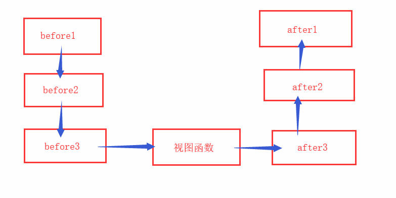
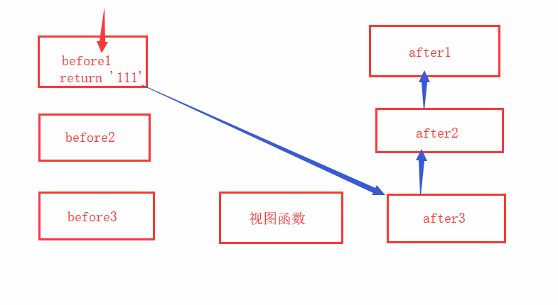
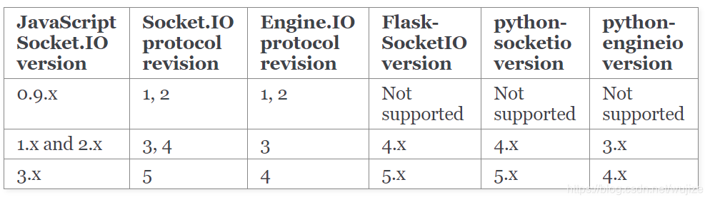

# flask

---
[toc]

## 安装

~~~shell

pip install flask
pip3 install flask
~~~

根据安装的pip版本来安装

## 简单使用

~~~python

from flask import Flask 
app = Flask(__name__)

@app.route('/')
def index():
    return "home"

if __name__ == "__main__":
    app.run()
~~~

### 开启调试模式

~~~python

app.debug = True    #方式1
app.config['DEBUG'] = True  #方式2
app.run(debug = True)   #方式3
~~~

### flask实例初始化

~~~python

app=Flask(__name__,参数)
~~~

|参数|说明|
|--|--|
|template_folder|摸板文件存放路径|
|static_folder|静态文件存放路径|
|static_url_path|静态文件在url中的路径，默认'/{static_folder}'|
|static_host|静态文件了存放的服务器host|

### flask对象的配置

~~~python

default_config = ImmutableDict(
        {
            "ENV": None,
            "DEBUG": None,  #DEBUG模式，True开启
            "TESTING": False,   #测试模式，True开启
            "PROPAGATE_EXCEPTIONS": None,   #异常传播(是否在控制台打印LOG) 当Debug或者testing开启后,自动为True
            "PRESERVE_CONTEXT_ON_EXCEPTION": None,
            "SECRET_KEY": None, 
            # secret秘钥
            # 使用一下代码自动生成秘钥
            # import os
            # os.urandom(24)
            "PERMANENT_SESSION_LIFETIME": timedelta(days=31),   #secret超时时间
            "USE_X_SENDFILE": False,    #是否弃用 x_sendfile
            "SERVER_NAME": None,    #服务器域名
            "APPLICATION_ROOT": "/",    #项目完整路径
            "SESSION_COOKIE_NAME": "session",   #cookies中session键名称
            "SESSION_COOKIE_DOMAIN": None,  #在哪个域名下会产生session记录在cookies中
            "SESSION_COOKIE_PATH": None,    #cookies的路径
            "SESSION_COOKIE_HTTPONLY": True,    #控制 cookie 是否应被设置 httponly 的标志，
            "SESSION_COOKIE_SECURE": False, #控制 cookie 是否应被设置安全标志
            "SESSION_COOKIE_SAMESITE": None,    #cookie盐
            "SESSION_REFRESH_EACH_REQUEST": True,   #这个标志控制永久会话如何刷新
            "MAX_CONTENT_LENGTH": None, #如果设置为字节数， Flask 会拒绝内容长度大于此值的请求进入，并返回一个 413 状态码
            "SEND_FILE_MAX_AGE_DEFAULT": None,  # hours 默认缓存控制的最大期限
            "TRAP_BAD_REQUEST_ERRORS": None,     
            # 如果这个值被设置为 True ，Flask不会执行 HTTP 异常的错误处理，而是像对待其它异常一样，
            # 通过异常栈让它冒泡地抛出。这对于需要找出 HTTP 异常源头的可怕调试情形是有用的。
            "TRAP_HTTP_EXCEPTIONS": False,  
            #  # Werkzeug 处理请求中的特定数据的内部数据结构会抛出同样也是“错误的请求”异常的特殊的 key errors 。
            # 同样地，为了保持一致，许多操作可以显式地抛出 BadRequest 异常。
            # 因为在调试中，你希望准确地找出异常的原因，这个设置用于在这些情形下调试。
            # 如果这个值被设置为 True ，你只会得到常规的回溯。
            "EXPLAIN_TEMPLATE_LOADING": False,  
            "PREFERRED_URL_SCHEME": "http",  # 生成URL的时候如果没有可用的 URL 模式话将使用这个值
            "JSON_AS_ASCII": True,   
            # 默认情况下 Flask 使用 ascii 编码来序列化对象。如果这个值被设置为 False ，
            # Flask不会将其编码为 ASCII，并且按原样输出，返回它的 unicode 字符串。
            # 比如 jsonfiy 会自动地采用 utf-8 来编码它然后才进行传输。
            "JSON_SORT_KEYS": True,
            # 默认情况下 Flask 按照 JSON 对象的键的顺序来序来序列化它。
            # 这样做是为了确保键的顺序不会受到字典的哈希种子的影响，从而返回的值每次都是一致的，不会造成无用的额外 HTTP 缓存。
            # 你可以通过修改这个配置的值来覆盖默认的操作。但这是不被推荐的做法因为这个默认的行为可能会给你在性能的代价上带来改善。
            "JSONIFY_PRETTYPRINT_REGULAR": False,
            "JSONIFY_MIMETYPE": "application/json",
            "TEMPLATES_AUTO_RELOAD": None,  
            "MAX_COOKIE_SIZE": 4093,    #最大cookie字节
        }
    )
~~~

配置方法一：

~~~python

app.config["DEBUG"] = True
~~~

配置方法二：

~~~python
class FlaskSetting:
    DEBUG = True
    SECRET_KEY = "密钥"
app.config.from_object("settings.FlaskSetting")
~~~

### response响应

|django|flask|
|--|--|
|HTTPResponse|""|
|render|render_template("摸板路径")|
|redircet|redircet|

- 特殊响应

  - send_file("文件路径")：打开并返回文件内容，并在响应头中添加`Content-Type:文件格式`与`Content-Length:文件大小(bytes)`

  - jsonify({k:v}):返回一个json字符串，并在响应头中添加`Content-Type:application/json`

摸板文件编写参看[janjia2](./jinajia2.md)

### request请求

|方法|说明|
|--|--|
|request.args|获取url中的数据|
|request.form|获取表单中的数据|
|request.data|获取请求体的原始信息,只有在`Content-Type`没有`Form`,返回字节 |
|request.json|获取请求头中的 `Content-Type:application/json`的数据，返回字典|
|request.files|获取FormData中的文件数据，可以使用`request.files.save(默认提交的文件名)`来保存文件|
|request.cookies|获取请求中的cookies|
|request.headers|获取请求头|
|request.path|获取请求路径(不带host)|
|request.url|获取请求完整路径(带host)|
|request.url_root|与path一样|
|request.method|获取请求方式|

### session

~~~python

 #先配置好sessionkey秘钥并导入
@app.routr("/")
def home(): 
    session[k]=v    #设置session值
    return '登录成功'
session[k] #获取session值
~~~

### 路由与视图函数

#### FBV

~~~python

@app.route("/") #fvb为视图函数添加路由
def index():
    return "home"

@app.route("/img/<int:id>/<file>")  #路由参数动态，相当于django中url参数传递，可以指定传参的类型，不指定就是字符串，还有float类型等。还可以使用defaults参数设置默认值
def img(id,file):
    print(id,file)
    return "没有这个文件"

@app.route('/log',defaults={'id':'1'})  #设置视图函数默认值，如果有动态参数传递，也会使用默认值
def log(id):
    return id

@app.route("/admin/",strict_slashes=True)   #严格模式，True访问路径必须与路由路径一致，默认True
def admin():
    return "bibi"

@app.routr('/admin/log',methods = ['POST', 'GET'])  #请求方式指定还有GET、HEAD、POST、PUT、DELETE、PATCH、OPTIONS
def admin_log():
    if request.method=='POST':
        return "注册成功后"
    if request.method == 'GET':
        return "注册"
~~~

- 通过视图函数获取匹配路由
`url_for("视图函数名",形参=实参)`
- 给视图函数取别名
`endpoint="别名"`
- 路由重定向
`redirect_to=“新路由”`，没有进到视图就重定向
- 子域名前缀
`subdoadmin=“car”`,需要配置app.config["SERVER_NAME"] = "xxx.com"

#### CBV

~~~python

class Login(views.MethodView):
   
def get(self):
    return "login"

def post(self):
    return "post_login"

app.add_url_rule("/login",view_func=Login.as_view(name="login"))    #给视图类绑定路由
~~~

### 蓝图

~~~python

蓝图.py

from flask import Blueprint
bp = Blueprint("bp",__name__,url_prefix="/user")    #同一个flask中那图名称不能重复，url_prefix蓝图url前缀
@bp.route("/bp",methods=["GET","Post"])
def my_bp():
    return "I am bp in user.py"
~~~

~~~python

flask.py

import 蓝图
app.register_blueprint(蓝图.bp) #需要想提前导入蓝图文件
~~~

#### 项目结构

中、小型项目

~~~shell
.
├── manage.py   #运行flask实例，并导入配置
└── pro_flask   #工程文件夹
    ├── __init__.py #生成flask实例并绑定蓝图
    ├── settings.py #生成flask配置类
    ├── static  #存放静态文件
    ├── templates   #存放摸板文件
    └── views   #视图函数
        ├── add.py  #生成视图蓝图，并生成视图函数
        ├── delete.py
        ├── select.py
        └── update.py
~~~

大型项目

~~~shell

.
├── pro_flask    #工程文件夹
│   ├── admin   #蓝图文件夹
│   │   ├── __init__.py #生成蓝图
│   │   ├── static  #存放蓝图静态文件
│   │   ├── templates   #存放蓝图摸板文件
│   │   └── views.py    #生成蓝图视图函数
│   ├── __init__.py #生成flask实例并绑定蓝图
│   ├── settings.py #生成flask配置类
│   └── web
│       ├── __init__.py
│       ├── static
│       ├── templates
│       └── views.py
└── manage.py  #运行flask实例，并导入配置
~~~

### 中间件 特殊装饰器

- `@app.before_request` :在请求进入视图函数之前
- `@qpp.after_request`  :在视图返回响应到客户端之前
- `@app.errorhandler(错误码)`   :重定义错误

~~~python

@app.before_request
def before():
    print('bf1')

@app.after_request
def after(response):    #必须要接受response参数
    print('af1')
    return response #必须返回response

@app.errohandler(404)
def error404(error):    #必须要接受error参数
    print('error')
~~~

before_request返回值为None时的流程:

before_request有返回值时的流程:

## 摸板-jianjia2

[jianjia2笔记](./jianjia.md)

## websocket

### flask-sockets

由于flask2.0配套的werkzeug2.0版本有bug，会导致只有火狐浏览器可以连接websocket成功

使用flask1.0配套的werkzeug1.01版本可以解决

### flask-socketio

前端js库与后端socketio库版本有兼容问题

