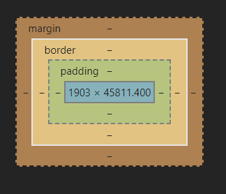

# JQuery

---

## 导入jquery

在html文件中添加script标签，并设置src属性为jquery文件的路径

~~~html5

<scrip src="jquery.js文件路径"></scrip>
~~~

## 选择器

### 基本选择器

~~~js

id选择器
$("#c1");

标签选择器
$("div");

class选择器
$(".c1");

同css选择器
~~~

### 基本筛选器

~~~js

用法
$("基本选择器:基本筛选器")

:first  #第一个
:last   #最后一个
:eq(index)  #索引
:even   #所有偶数索引,从0开始
:odd    #所有奇数索引,从0开始
:gt(index)  #大于索引
:lt(index)  #小于索引
:not(选择器)    #移除满足选择器
:has(选择器)    #后代有符合选择器,的父级标签
~~~

### 属性选择器

~~~js

[属性]
[属性=属性值]
[属性!=属性值]
~~~

### 表单筛选器

~~~js

:text   #输入框
:password   #密码
:file   #文件
:radio  #单选
:checkbox   #多选
:submit #提交
:reset  #重置
:button #按钮
:enabled   #可用的标签
:disabled  #不可用的标签
:checked   #选中的input标签
:selected  #选中的option标签(下拉框)
~~~

### 筛选器方法

~~~js

下一个
$("div").next();    #下一个兄弟节点
$("div").nextAll();     #后面所有兄弟节点
$("div").netUntil(选择器);  #后续兄弟节点直到满足选择器,但不报过它

上一个  #与下一个对应
$("#id").prev()
$("#id").prevAll()
$("#id").prevUntil("#i2")

父标签
$("#id").parent()   #父亲标签
$("#id").parents()  #祖先标签
$("#id").parentsUntil('body')   #向上找祖先标签直到符合选择器,但不包括

儿子与兄弟标签
$('ul').children();     #所有儿子标签
$('ul').children('#l3');    #符合选择器的儿子标签
$('#l5').siblings();    #所有兄弟标签
$('#l5').siblings('#l3');   #符合选择器的兄弟标签
$('ul').find('#l3')     #符合选择器的后代标签
$('li').filter('#l3');   #在符合选择器1的结果找筛选符合选择器2的标签
.first() // 获取匹配的第一个元素
.last() // 获取匹配的最后一个元素
.not() // 从匹配元素的集合中删除与指定表达式匹配的元素
.has() // 保留包含特定后代的元素，去掉那些不含有指定后代的元素。
.eq() // 索引值等于指定值的元素
~~~

## 标签操作

### class操作

~~~js

$("").addClass(类值名); #添加类值
$("").removeClass(类值名);  #删除类值
$("").hasClass(类值名); #判断是否有该类,有返回ture,无false
$("").tiggleClass(类值名);  #有就删类值,无就就添加
~~~

### css操作

~~~js

$("").css({"属性":"属性值"});   # 设置css值
~~~

### 位置操作

~~~js

$("").position();   #查看相对位置
$("").offset(); #查看绝对位置

$(window).scrollTop();   #窗口位置

设置
$("").position({"top":"20","left":"20"})
~~~

### 尺寸操作

~~~js

$("").height(); #内容高度
$("").width();  #内容宽度
$("").innerHeigt(); #内容+内边距高度
$("").innerWidth(); #内容+内边距宽度
$("").outerHeight();    #内容+内边距+边框高度
$("").ourterWidth();    #内容+内边距+边框宽度
~~~

### 文本操作

~~~js

$("").html();   #获取标签的全部内容,识别标签
$("").text();   #获取标签文本内容,不识别标签
$("").html("内容"); #设置内容
~~~

### 值设置

~~~js

获得值
$("").val();    #获取值
对于select与checkbox多选在选择正确后获取值需要对选择器进行循环获取

设置值
$("").val(["2","5"]);   #设置多个值
~~~

### 属性操作

~~~js

$("").attr("属性名");   #获取属性值
$("").attr({"属性名":"属性值"});    #设置属性值
$("").removeAttr("属性名"); #删除属性

prop与attr相似,单一般用于对checker\selected\disabled属性
$("").prop("checker","ture");   #设置下拉多选值
~~~

### 文档处理

~~~js

添加到指定元素内部的后面
$(a).append(b)  #把b追加到a
$(b).appendTo(a)  #把b追加a
$('#d1').append('<a href="http://www.jd.com">京东</a>');

添加到指定元素内部的前面
$(a)prepend(b); #把b前置到a
$(b)prependTo(a);   #把b前置到a

添加到指定元素外部的后面
$(a).after(b);   #把b放到a的外部后面
$(A).insertAfter(B);    #把a放到b的外部后面

添加到指定元素外部的前面
$(A).before(B);  #把B放到A的前面
$(A).insertBefore(B);    #把A放到B的前面

移除和清空元素
$(A).remove();  #删除标签内所有内容与标签
$(A).empty();   #删除标签内所有内容

替换
$(A).replacWith(b); #把B代替A
$(A).relaceAll(b);  #把A代替B

克隆
$(a).clone();   #克隆a
~~~

## 事件

### 绑定事件

~~~js

事件绑定
$("").click(function(){事件js代码})
一般使用这种
$("").on("事件",函数)
~~~

### 删除事件

~~~js

.off("事件",函数)
~~~

### 常用事件

事件|描述|
--|--|
click|左键点击|
focus|获取光标|
blur|失去光标|
change|域内容发生改变|
mouseenter|鼠标移入|
mouseover|鼠标移入(移入子标签也触发)|
mouseout|鼠标移出|
keyup|键盘抬起$(window)|
keydowm|键盘按下$(window)|
hover|鼠标放置(配两个函数一个移入,一个移出)|
input|监听输入值,未提交(只可使用on来绑定)|

### 阻止事件冒泡

由于子标签事件可能会到导致触发父级标签的事件所以需要对子标签的事件进行阻止,可以在子标签事件的执行函数中执行`return false;`或者`e.stopPropagation();`e为传入参数,及事件本身

### 事件委托

~~~js

$("").on("事件",父级或祖先标签,函数)
~~~

将子标签事件绑定到父级标签上,这样js添加的新标签也会带上原标签的效果

### 页面加载

~~~js

本方法会出现方法覆盖,要等待图片资源加载后执行
window.onload = function () {js代码}

一般使用以下两种
会等待html文档加载后执行
$(function (){js代码})

$(document).ready(function(){js代码});
~~~

为了保证js代码的在整个页面加载后执行,需要将js代码放到以上方法中.

## 动画效果

~~~js

隐藏/显示
$("").hide(动画持续时间,完成后执行的函数);   #隐藏
$("").show(动画持续时间,完成后执行的函数);  #显示
$("").toggle(动画持续时间,完成后执行的函数);    #显示就隐藏,隐藏就显示

淡入/淡出
$("").fadeIn(动画持续时间,完成后执行的函数);    #淡入显示
$("").fadeOut(动画持续时间,完成后执行的函数);   #淡出隐藏
$("").fadeToggle(动画持续时间,完成后执行的函数) #淡入淡出方式,显示及隐藏,隐藏及显示
$("").fadeTo(动画持续时间,透明度(0-1),完成后执行的函数);    #将标签渐变成指定透明度

滑入/滑出
$("").slideDown(动画持续时间,完成后执行的函数); #向下滑动显示隐藏的元素
$("").slideUp(动画持续时间,完成后执行的函数);   #向上滑动隐藏显示的元素
$("").slideToggle(动画持续时间,完成后执行的函数);   #用滑动方式,显示及隐藏,隐藏及显示

动画(类似flash中设置初始状态与结束状态,自动补充中间的效果)
$("").animate({css属性},动画持续时间,完成后执行的函数)  #可以设置css属性为+=\-=设置相对值,show\hide\toggle/显示\隐藏\反转,也可写多个进行队列执行

停止
$("").stop(后续动画是否继续执行,是否立即显示当前动画的结束状态);    停止当前动画

多个动画效果可以用.链接与队列执行一样
~~~

## 补充

### 循环

~~~js

循环标签对象数组
$('li').each(function(k,v){
console.log(k,v);
});

循环普通数组
var d1 = ['aa','bb','cc'];
$.each(d1,function(k,v){
console.log(k,v);
})

跳出循环  return false; 类似于break
$('li').each(function(k,v){
console.log(k,v.innerText);
if (k === 1){
return false;
}

});

跳出本次循环  return; 类似于continue
$('li').each(function(k,v){
if (k === 1){
return;
}
console.log(k,v.innerText);
});
~~~

### data

~~~js

给标签对象添加数据,类似于添加了全局变量
.data(key, value): 设置值
.data(key)   取值
.removeData(key) 删除值
~~~

## 图标操作

图标操作:在iconfont网站下载所需的图标并参考demo即可学会

## bootstrap使用

打开`https://v3.bootcss.com/getting-started/`网站,查看所需要的样式并复制修改
