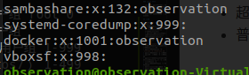

# linux基础使用

---

[toc]

## 终端

查看终端的命令 tty

* 设备终端
* 虚拟终端 ctrl+alt+f[1-6] /dev/tty#
* 图形终端 /dev/tty7
* 串行终端
* 伪终端(通过ssh远程连接的终端) /dev/pts/#

查看ip地址 ip addr

### 交互式接口

* GUI(桌面)
* CLI (命令行)
  1. powershell(windows)
  2. sh
  3. bash(liunx,mac默认)
  4. zsh
  5. csh
  6. tcsh

### bash

bash是linux系统的用户界面，提供了用户与系统的交互，它接受用户的输入，让它送给操作系统执行

* 查看当前使用的shell echo $SHELL
* 查看当前系统可以使用的shell cat /etc/shells
* 切换shell chsh -s shell路径

### bash快捷键

1. ctrl+l 清屏 相当与执行clear命令
2. ctrl+o 执行当前的命令，并显示该命令
3. ctrl+s 锁定，不可输入
4. ctrl+q 解锁
5. ctrl+c 终止命令
6. ctrl+z 挂起命令(使用fg恢复到前台，bg恢复到后台继续执行)
7. ctrl+a 光标移动到行首，相当`home`
8. ctrl+e 光标移动到行尾，相当`end`
9. ctrl+xx 光标在开头与当前位置跳转
10. ctrl+k 删除光标到最后的内容
11. ctrl+u 删除光标到开始的内容
12. ctrl+r 查找输入过的命令
13. alt+r 删除整行

### 命令提示符

~~~shell
用户@计算机名:当前路径#
管理员用户为 # 
普通用户为 $
~~~

## 命令

* 内部命令：是shell自带的命令
  * 只有内部命令可以使用 help 命令 来查看帮助
* 外部命令：第三方提供的命令

查看命令类型 type 命令

### 别名

* 查看当前所有别名 alias
* 设置别名 alias 别名="命令"
  * 设置别名只对当前终端有效
* 取消设置的别名 unalias 别名
* 查看命令的路径 which 命令

如要设置永久别名 echo 'alias 别名="命令"' >> /etc/bashrc(对所用户有效)|~/.bashrc(对当前用户有效)

要执行命令本书：

1. \command
2. "command"
3. 'command'
4. path

### 命令格式

command [options...][args...]
命令 [选项] [命令作用体]

args：命令的作用体，一般是目录或文件，用户名
options：开启或关系命令的某些功能

* 长选项 --help --color
* 段选项 -i -l

1. 短选项可以合并
2. 命令、选项、作用体之间用空格隔开
3. `crtl`+`c`可以结束命令的执行
4. 同一行执行多个命令使用`;`分隔命令
5. 一个命令使用多行输入用`\`连接

### 命令帮助

内部命令：

1. help command
2. man command

外部命令：

1. command -h
2. command --help
3. man cmmand
4. 官方文档

~~~shell
[]可选项
<>表示比变化的数据
...表示列表
a|b|c 或者 -abc 表示 -a -b -c
{} 表示分组
~~~

### tab键

命令补全：

1. 内部命令直接补全
2. 外部命令：根据环境变量定义的路径，从前往后依次查找，自动匹配第一个查找的内容
3. 如果用户给的内容只有一个匹配则补全
4. 如果有多个匹配，则需要按`tab`键显示提示

### 引号

对于变量`""`会显示对象值
`''`则会显示变量本身

* 变量的使用$变量名

对于命令``会显示命令的结果
引号则会显示命令本身

### 命令历史

1. 可以通过上下来查找之前执行的；命令
2. 之前执行的命令在～/.bash_history文件中,或者执行history来查看
3. 执行上一条命令可以使用上箭头|!!|!-1来实行
4. !#指定第#条命令
5. !string 用来匹配最近因此匹配到的命令
6. !-#指定倒数第#条命令
7. ctrl+r 搜索命令
8. ctrl+g 取消搜索

### 命令展开

~~~shell
{1..20..2}
1到20步长2
~~~

### echo 回显

~~~shell
echo -e '456\n123'  #翻译字符中的转义字符
~~~

### 管道符

~~~shell

命令1|命令2|命令3 #将命令1的结果作为命令2的输入，再将命令2的输出给命令3作为输入
~~~

* 默认情况下管道之传送标准输出
* 也可以把错误输出传递 |&
* 一些命令是不接受管道传递

### 查看用户登陆

1. 查看当前登陆用户 whoami
2. 显示所有用户执行的命令 w

### 时间

1. 查看当前时间 date
2. 修改时间 date 时间
3. 同步ntp时间源 ntpdate ntp时间源地址

|命令拓展|效果|
|--|--|
|date +%a|显示星期缩写|
|date +%A|显示星期全写|
|date +%F|显示年月日|
|date +%H|显示小时(24小时制)|
|date +%I|显示小时(12小时制)|
|date +%m|显示月份(数字)|
|date +%M|显示分钟|
|date +%h|显示月份(字符)|
|date +%c|显示本地时间|
|date +%T|显示时分秒|
|date +%y|显示年(后两位)|
|date +%Y|显示年|
|date +%Y/+%m/+%d|显示年月日|
|date +%W|显示本周为今年第几周|

1. 显示时区 timedatectl
2. 修改时区 timedatectl set-timezone 时区

### 日历

显示日历 cal

|命令|效果|
|--|--|
|cal|显示本月日历|
|cal -y|显示本年日历|
|cal 年|显示当年日日|

### 关机/重启

|关机命令|效果|
|--|--|
|shutdown|一分钟后关机|
|shutdown -c|取消关机|
|shutdown +#|#分钟之后关机|
|shutdown hh：mm|指定时间关机|
|poweroff|立刻关机|
|halt|关机，当保持通电|
|init 0|立刻关机|
|reboot -p|关机|

|重启命令|效果|
|--|--|
|reboot|重启|
|shutdown -r|重启|
|init 6|重启|

## 文件

### 文件目录结构

1. 文件和目录被组织在一颗倒置的树状结构
2. 系统文件从`/`根文件开始
3. 文件严格区分大小写
4. 隐藏文件以`.`开头
5. 路径以`/`为分隔符
6. 文件名长度最大为255
7. 路径最大4095字符(包含文件名称)
8. 除了`\`与NULL不可使用和，其他字符都可以用来命名文件与文件夹

|文件名字颜色|代表|
|--|--|
|蓝色|文件夹|
|绿色|可执行文件|
|红色|压缩文件|
|蓝绿色|连接文件|
|灰色|其他文件|
|白色|文件|

### 文件系统结构

* /boot 引导文件的存放位置，内核文件、引导加载器都在此目录
* /bin 所有的用户都可以使用的命令
* /sbin 管理类的命令
* /lib 启动时程序使用的基本库文件 .so结尾
* /lib64 专门存放X86_64系统上得辅助库文件
* /etc 存放配置文件
* /home/USERNAME 普通用户的家目录
* /root 管理员的家目录
* /media 便携式移动设备的挂载点
* /mnt 临时文件的挂载点
* /dev 设备文件和特殊文件的存放位置
* /opt 第三方的应用的安装位置
* /tmp 临时文件的存放位置
* /usr 存放安装程序
* /var 存放经常变化的文件，比如日志
* /proc 存放内核启动和进程相关的虚拟文件
* /sys 输出当前系统上的硬件相关的文件
* /srv 系统上允许的服务用到的数据

* 二进制文件
  * /bin
  * /sbin
  * /usr/bin
  * /usr/sbin
  * /usr/local/bin
  * /usr/local/sbin
* 库文件
  * /lib
  * /lib64
  * /usr/lib
  * /usr/lib64
  * /usr/local/lib
  * /usr/local/lib64
* 配置文件
  * /etc
  * /etc/name
  * /usr/local/etc
* 帮助文件
  * /usr/share/man
  * /usr/share/doc
  * /usr/local/share/man
   /usr/local/share/doc

### 绝对路径与相对路径

绝对路径：

* 以根开始
* 完整的文件的存放位置
* 可以读取到任何一个文件或文件夹

相对路径：

* 不以根路径开始
* 相对当前位置来决定
* 可以简短的表示一个文件或者文件夹
* `.`当前目录
* `..`父级目录

### 文件命令

|命令|说明|
|--|--|
|basename 路径|文件名称或文件架名称|
|dirname 路径|路径名称(去除最后的文件或者文件夹名称)|
|cd 路径|切换目录|
|cd|切换到家目录|
|cd -|返回上一次的目录|
|pwd|显示当前的工作的目录|
|ls|显示当前目录下的文件(不够详细)|
|ls -a|显示当前目录下的所有的文件|
|ls -l|以长格式显示文件列表|
|ls -R|递归显示目录|
|ls -1|文件一行一个显示|
|ls -r|倒序显示|
|ls -lh|与-l类似但是文件大小带上单位|
|ls -S|按照文件大小排序|

#### 长格式显示例子

~~~shell

lrwxrwxrwx#文件权限(第一位是文件格式)   1#硬盘引用次数 root#所属用户 root#所属用户组          7#大小 9月  13 20:01#访问时间 bin -> usr/bin#文件名称，连接对应路径
~~~

#### 权限说明

|文件格式|说明|
|--|--|
|-|文件|
|d|目录|
|b|块设备|
|c|字符设备|
|l|连接文件|
|s|socket套接字|

权限使用9位表示，3位一组。
3主分别是：

* 所属用户 u
* 所属用户组 g
* 其他用户 o
* 另外还有全部 a

三位代表3个权限

* 读 r
* 写 w
* 执行 x

数字表示就是将3组用二进制计算值

对于文件来说：

* r 可以使用文件查看工具查看
* w 可以修改无不的内容
* x 可以直接执行

对目录来说

* r 可以使用ls等目录查看命令查看
* w 可以创建文件，也可以删除
* x 可以cd 进入目录

修改权限

~~~shell

chmod u+x 文件 #增加用户运行权限
chmod u-x 文件 #删除用户运行权限
chmod u=r 文件 #给用户赋值运行权限，其他群像删除
chmod 权限数字 文件

chattr +i 文件 #特殊权限不可以删除、修改、变更
lsattr 文件 #查看属性
chattr +a #只能最追加数据
~~~

查看文件状态

~~~shell
observation@observation-VirtualBox:/etc/ssh$ stat ssh_config
  文件：ssh_config
  大小：1603         块：8          IO 块：4096   普通文件
设备：805h/2053d   Inode：1968290     硬链接：1
权限：(0644/-rw-r--r--)  Uid：(    0/    root)   Gid：(    0/    root)
最近访问：2020-05-29 15:37:09.000000000 +0800
最近更改：2020-05-29 15:37:09.000000000 +0800
最近改动：2020-09-13 20:01:20.719967589 +0800
创建时间：-

atime 访问时间  查看文件内容就会改变
mtime 修改时间  改变内容发生变化
ctime 改动时间  元数据发生变化
~~~

#### 文件通配符

* `*`所有
* `?`匹配任一单个字符
* `~`用户家目录
* [123456]其中一个
* [^123456]取反
* [0-9]数字
* [a-z]小写字母(缺少Z)
* [A-Z]大写字母(缺少a)
* [:lower:]小写字母
* [:upper:]大写字母
* [:alpha:]大写+小写字母
* [:alnum:]字母+数字
* [:digit:]数字

#### 文件操作

|命令|说明|
|--|--|
|touch 文件名|创建空文件(如果存在同文件，则刷新时间)-a 只修改atime和ctime -m 只修改mtime和ctime|
|mkdir 路径名|创建目录 -p 递归创建 -v 显示详细过程|
|rmdir 路径名|删除空目录 -p递归删除 -v显示过程|
|rm 文件名|删除文件 -r 递归 -f 强制 -i 提示|
|cp 原文件 路径|复制 -i 显示提示 -n 不覆盖 -r 递归复制 -d 只复制连接文件，不复制源文件 -a 归档 -v 显示过程 -b 备份原来的文件文件 -p 保留原来的属性|
|mv 原文件 新文件名/路径|移动或者重命名 -i 显示提示 -f 强制 -b 备份 |
|file 文件| 查看文件类型|
|dd if=输出文件 of=出入文件 bs=读取大小 count=次数 |读取一个文件输入到另外一个文件中|

##### 复制说明

1. 源文件是文件：
   * 目标是文件：
     * 如果目标不存在，则新建目标文件，并把内容复制过去
     * 如果目标存在，本命令是直接覆盖，所以带上-i参数来提示用户
   * 目标是文件夹：
     * 在文件夹中创建同名文件，并复制内容
2. 源文件是多个文件：
   * 目标必须是一个文件夹，而且必须存在，不然会报错
3. 源文件是文件夹：
   * 目标文件必须是文件夹并且带上参数-r

### 连接

~~~shell

ln 源文件 目标文件 #创建硬连接
ln -s 源文件 目标文件 #创建乱连接
~~~

1. 软连接：
   * 相当于windows的快捷方式
   * 可以对目录做软连接
   * 软连接的大小是源文件的路径字符长度
   * 软连接不会修改i磁盘应用次数
   * 可以跨分区
   * 源文件发生改变，软连接文件也跟着改变
   * 源文件删除，软连接不可访问，但是重新创建与源文件同名文件还是可以访问
2. 硬连接
   * 会改变磁盘引用数的变化
   * 指向硬盘的同一区域
   * 不可以对目录硬连接
   * 不可以跨分区
   * 源文件发生改变，硬连接文件也方式改变
   * 删除源文件，硬连接还可以继续访问

## 输出输入

* 标准输入：默认输入是来自键盘 stdin 0
* 标准输出：默认输出到终端窗口 stdout 1
* 标准错误输出：默认输出到终端窗口 stderr 2

### I/O重定向

覆盖 >

* 将标准输出重定向到文件中 命令 > 文件
* 将错误输出重定向到文件中 命令 2> 文件
* 将所有输出重定向到文件中 命令 &> 文件
* 禁止覆盖 set -C
* 允许覆盖 set +C
  
追加 >>

* 将标准输出重定向到文件中 命令 >> 文件
* 将错误输出重定向到文件中 命令 2>> 文件
* 将所有输出重定向到文件中 命令 &>> 文件

标准输出与错误输出分开保存:

* 命令 >> log.log 2>> err.log

合并所有输出：

* 命令 >> 文件 2>&1

所有内容都可以丢到/dev/null文件中

#### 多行内容输入文件

~~~shell

cat > 文件 #要使用crrl+c结束
cat > 文件 << EOF #结束单行输入EOF，EOF只是标记也可使用其他字符
~~~

### 替换

~~~shell

tr 源字符 替换字符 < 文件 #替换字符串
tr -t 源字符 替换字符  #以替换字符为标准进行一对一替换
tr -d 源字符 #删除源字符
tr -s 源字符 #对源字符进行去重
tr -sc 源字符 #对除源字符外的字符去重
tr 源字符 替换字符 < 文件A > 文件B #将a文件中内容进行替换输出到文件b中，本公约替换回源文件
~~~

### 显示

1. cat 显示文本
   * -E 显示结尾换行符
   * -n 显示每行编号
   * -b 只对非空行进行编号
   * -s 对连续空行进行压缩
2. tac 倒序显示
3. less 分屏显示
   * 向下一行 `回车`
   * 向下一页 `空格`
   * 退出 `q`
   * 搜索 `/文本`
     * 向下查找 `n`
     * 向上查找 `N`
   * man命令默认打开方式
4. more 分页显示文本
   * 默认显示读取的百分比
   * 读取完成自动退出
   * 退出 `q`
   * 显示翻页与退出提示 `d`
5. head 显示文件的前面内容  
   * 默认显示文本前10行
   * 显示前#行 -n # 或 -#
   * 显示前#字符 -c #
6. tail 显示文件的后面内容
   * 默认显示文本后10行
   * 显示后#行 -n # 或 -#
   * 显示后#字符 -c # (换行符也是一个字符)
7. cut 切割
   * cut 文件
   * 按照字符切割 -c#-#
   * 按指定符号切割，默认是`TAB` -d#
   * 显示切割后的第#个字段 -f#,#,#,#-#
8. paste 合并
   * paste 文件1 文件2
   * 按行合并，默认以`TAB`合并，也可以指定合并符 -d#
   * 原本行按列显示 -s

### 分析

1. wc 对文本进行统计
   * wc 文件
   * 行数 单词数 字节数 文件名
   * 只显示行 -l
   * 只显示单词数 -w
   * 只显示字节数 -c
   * 只显示字符数 -m
   * 最长的行的长度 -L
2. sort 排序
   * sort 文件
   * 默认从前往后按行排序
   * 倒序 -r
   * 随机排序 -R
   * 按数字排序 -n
   * 忽略大小写 -f
   * 指定分隔符 -t
   * 按指定字段排序 -k
3. uniq 合并相同的行
   * uniq 文件1
   * 相邻的完全一样内容就是相同行
   * 显示相同行出现的次数 -c
   * 只显示重复的行 -d
   * 显示从没有重复的行 -u
4. diff 对比文件
   * diff 文件1 文件2

### 查找

#### find

在linux中的实时查找文件工具

find [options] ... [查找路径][查找条件][处理动作]
查找路径：查找的位置，默认当前路径
查找条件：指定查找的标准，文件名、大小、类型、日期等

1. 查找条件
   * 根据文件名查找
     * 指定名称，可以使用正则 -name
     * 忽略大小写 -iname
     * 引用次数 -linsk #
     * -regex 后面跟完整路径，必须
   * 指定搜索的层级
     * 最大搜索深度，当前目录为第一层   -maxdepth #
     * 最小搜索深度，包括指定层 -mindepth #
   * 根据文件或路径属主、属组来查找
     * 查找属主为#的文件 -uesr #
     * 查找属组为#的文件 -group #
     * 查找属主id为#的文件 -uid #
     * 查找属组id为#的文件 -gid #
     * 查找没有属主的文件 -nouesr
     * 查找没有属组的文件 -nogroup
   * 根据文件类型查找 -type
     * 目录 d
     * 文件 f
     * 符号连接 i
     * 套接字 s
     * 块设备 b
     * 字符设备 c
     * 管道文件 p
   * 空文件或空目录 -empty
   * 条件之间逻辑
     * 与 -a
     * 或 -o
     * 非 -not
     * 非（a或b）=非a与非b
     * 非（a与b）=非a或非b
   * 排除路径 -path
     * 实际使用

       ~~~shell
      
       find /etc/ -path '/etc/ssh' -prune -o -name '*.conf'
       ~~~

   * 按照大小查找
     * （#-1，#] -size #
     * [0,#-1] -size -#
     * (#,...) -size +#
   * 按照时间来查找
     * [#,#+1) -atime #
     * (0,#) -atime -#
     * [#+1,...] -atime +#
     * 按m时间 -mtime
     * 按c时间 -ctime
     * 以分钟为单位
       * -amin
       * -mmin
       * -cmin
2. 处理动作
   * 显示在屏幕上，默认 -print
   * 不显示 -prune
   * 显示sl -l长格式显示 -ls
   * 删除查找到的文件 -delete
   * 将查找到的文件以长格式保存到文件中 -fls 文件
   * 对每个查找的文件执行命令，在每次执行前会询问用户是否执行 -ok 命令 {}\;
   * 对每个查找的文件执行命令，在每次执行前不会询问用户是否执行 -exec 命令 {}\;

##### xargs

* find -name file|xargs rm -rf
* 有的命令不支持管道符
* 将管道前的内容一条一条交给后面命令处理

#### grep

* gerp [option] "匹配字符" 文件
* 对匹配到的行添加颜色 --color=auto
* 取反 -v
* 查找的内容添加行号 -n
* 打印匹配的行号 -c
* 只显示匹配到的文字 -o
* 静默模式(不显示) -q
* 显示匹配连同向下#行 -A #
* 显示匹配连同向上#行 -B #
* 显示匹配来连同上下#行 -C #
* 匹配字符使用扩展则正表达式 -E
* 不使用正则表达式 -F
* 递归 -r
* 匹配整个单词 -w
* 指定匹配关键字 -e

##### 正则

[正则表达式](./re.md)

## vim

[vim笔记](./vim.md)

## 压缩

### gzip

* gzip [option] ... file
* 将压缩后的文件输出到屏幕，保留原来的文件 -c gzip -c 1.txt > 1.txt.gz
* 指定压缩比 1-9 默认9 -1-9
* 解压 -d gzip -d 1.txt.gz
* 解压 gunzip 1.txt.gz
* 在不解压的情况下查看压缩文件内容 zcat 1.txt.gz

### bzip2

* bzip2 [option] ... file
* 保留原文件 -k
* 解压 -d
* 解压 bunzip 1.txt.bz2
* 指定压缩比 -1-9
* 不解压情况下查看压缩文件内容 bzcat 1.txt.bz2

### xz

* xz [option] ... file
* 保留原文件 -k
* 解压 -d
* 解压 unxz 1.txt.xz
* 指定压缩比 -1-9
* 不解压情况下参看压缩文件内容 xzcat 1.txt.xz

### zip

* zip [option] ... flie

### tar 归档工具

* tar [option] ... 归档文件 归档目录
* 创建归档文件 -c
* 显示过程 -v
* 指定归档文件 -f
* 复制原文件属性 -p
* 解压文件 -x
* 追加文件 -r
* 查看归档文件内容 -t
* 排除某文件 --exclude
* 使用gzip压缩 -z
* 使用bzip2压缩 -j
* 使用xz压缩 -J

### split 分卷

* split -b 指定分卷大小 文件(不可以为目录) 切割后的名称
* 指定切割后名称的后缀为数字(默认abc来排序) -d
* 指定后缀位数(默认3位) -a
* 合并 cat 切割后文件 > 合并后文件

## 用户

* 超级管理员 root id 0
* 普通用户
  * 系统用户：用来启动系统的一些服务和进程的用户不可登陆 1-999（centos7） 1-499（centos6）
  * 可登陆用户：能登陆的用户 1000-65535（centos7） 500-65535（centos6）

### 添加用户

* useradd [options] 用户名
* 系统用户的id是递减的，普通用户的id是递增的
* 指定用户的家目录 -d `useradd -d /home/aaa bb`
* 指定用户组的id -g 用户组id
* 指定附加用户组 -G 用户组名称
* 指定初始化家目录内的内容,配合创建家目录-m使用 -k 路径
* 创建家目录 -m
* 指定用户的表述信息 -c ‘描述信息’
* 不自动创建同名用户组 -N
* 指定用户登陆后使用的shell -s shell路径
* 指定用户id -u 用户id
* 显示系统默认配置 -D
* 修改系统默认配置 -D [options]
* 创建用户的默认文件 /etc/default/useradd
* 默认创建家目录时复制的路径 /etc/skel/*

### 修改用户

* usermod [options] 用户名
* 修改用户的描述信息 -c
* 修改用户的家目录，默认不会新建目录，如果需要移动家目录，则需要配合 -m是使用 -d
* 修改用户组 -g 用户组|用户组id
* 重新指定用户附加组 -G 用户组
* 追加附加组 -a
* 修改用户名 -l 新的用户名
* 锁定用户，不可以登陆，修改密码就可解锁 -L
* 解锁用户 -U
* 修改登陆后的shell -s
* 修改用户的uid -u
* 修改用户的过期时间 -e 年-月-日

### 删除用户

* userdel [options] 用户名
* 同时删除家目录 -r
* 强制删除 -R
* 默认情况下，用户在登陆状态下是不能删除用户的，强制删除用户后，用户还是可以继续使用的

### 查看用户

* id [options] 用户名
* 只显示组id -g
* 只显示附加组 -G
* 只显示用户id -u
* 只显名称可以配合g|u|G配合只用 -n
  
### 切换用户

* su [option] [-] 用户名
* 完整切换：环境变量等都会发生改变 `su - 用户名`
* 不完整切换：不会切换用户的环境变量家目录 `su 用户名`
* root切换普通用户不需要密码
* 在普通用户下执行某些需要root权限的命令 sudo 命令
* sudo配置文件为/etc/sudoers
  * 如下修改使执行sudo命令不再需要输入密码
    

### passwd 文件

/etc/passwd

* passwd文件记录了用户记录
* 用户名：密码占位符：uid:gid:描述信息：家目录：登陆后使用的shell

### 设置密码

* passwd [option] 用户名
* 删除指定用户的密码，删除之后就不可以的了登陆了 -d
* 锁定用户 -l
* 解锁用户 -u
* 在下次登陆时强制用户修改密码 -e
* 强制 -f
* 密码的最长使用天数（超过有效期需要修改） -x #
* 密码的最短使用天数(要超过该时间才可再次修改密码) -n #
* 密码距离过期还有多少天提示 -w #
* 密码过期多少天禁用 -i
* 从标准输出读取 --stdin `echo "456"|passwd --stdin aaa`
  
### shadow 存放文件

shadow记载了用户与密码/etc/shadow

用户：$加密方式$盐$加密后的字符$：距离1970年1月1日最后一次修改密码时间：密码最短时有时间（0表示随时可以修改）：密码最长使用时间（99999表示永久）：密码过期提醒时间（默认7）：密码锁定时间：密码失效时间（据1970年1月1日）

### 密码策略

* 必须包含数字、大小写字母、特殊字符
* 12位以上
* 不能是弱口令
* 必须是随机密码
* 3个月或者半年修改一次

### 修改用户密码策略

* chage [options] 用户

### chfn

* 修改用户个人信息（房间号、手机号等）
* chfn

## 用户组

* 超级用户组 root 0
* 普通用户组
  * 系统用户组 1-999（centos7） 1-499（centos6）
  
### 添加用户组

* groupadd
* 指定id -g
* 创建系统用户组 -r

### 组文件

/etc/group

组名：密码：gid：组成员

/etc/gshadow

组名：密码：组管理员密码：组成员

### 修改组信息

* groupmod [options] 组名称
* 修改组id -g
* 修改组名 -n

### 删除组

* groupdel 组名

## 软件

.rpm ：redhat package manager （redhat、centos）
.deb：Debian软件包（debian、ubuntu）

### 包的命名

MySQL-python-1.2.5-1.el7.x86_64.rpm
名称-版本(大版本，小版本，修订版)-打包版本.可用系统.rpm|deb

#### 包的来源

1. 光驱镜像
2. 第三方网站
3. 官方网站
4. http：//pkgs.org
5. epel 第三方包的结合地

### rpm

* 查询是否安装包 rpm -q 包名称
  * 全部 -a
  * 查看指定文件由那个文件安装 -f
  * 查看指定的包生成那些配置文件 -c
  * 查看指定的包生成那些文档 -d
  * 查询指定包的详细信息 -i
  * 查询指定的包生成的文件 -l
* 通过.rpm文件安装 rpm -i rpm文件
* 显示指令执行过程 -v

### yum

yum会自动解决依赖关系
仓库：存放的是多个包和包的元数据信息

仓库的位置：

* http：//
* https：//
* ftp：//
* file：//(本地文件)

配置文件 /etc/yum.repos.d

#### yum配置文件

~~~shell
[base] #名称
name=CentOS-$releasever - Base - mirrors.aliyun.com # 描述信息
failovermethod=priority # 定义挑选顺序 priority 按顺序 roundrobin 随机
baseurl=http://mirrors.aliyun.com/centos/$releasever/os/$basearch/
        http://mirrors.aliyuncs.com/centos/$releasever/os/$basearch/
        http://mirrors.cloud.aliyuncs.com/centos/$releasever/os/$basearch/
enabled ={0|1} 是否启用，1启用，0是不启用
gpgcheck={0|1} 使用校验
gpgkey=http://mirrors.aliyun.com/centos/RPM-GPG-KEY-CentOS-7 # 校验文件
默认值
$releasever 发行版
$basearch 系统架构
~~~

可以使用阿里、163、sohu、腾讯等源

#### yum命令

* 查看仓库信息 yum repolist
* 列出仓库里面所有的包，以安装的包前面带@ yum list
* 安装包 yum install
* 安装本地安装包 yum -y install 安装包.rpm
* 重新安装 yum reinstall
* 更新所有的包 yum update
* 更新指定包 yum update 指定包
* 降级 yum downgrade
* 检查包是否可以更新 yum check-update
* 卸载包 yum remove
* 显示包的详细信息 yum info 包
* 删除元数据信息（服务器上软件信息本地缓存） yum clean all
* 重新构建元数据信息 yum makecacche
* 搜索软件包（包含名称与描述信息） yum search
* 搜索命令是由那个包提供的 yum provides
* 静默模式 -q
* 自动确认 -y

#### 软件包组

* 查看包组 yum grouplist
* 安装包组 yum groupinstall
* 获取包组信息，查看包组由那些包组成 yum groupinfo
* 更新 yum groupupdate
* 卸载包组 yum groupremove

### dpkg

* 安装本地文件 dpkg -i 安装包.deb
* 删除安装包 dpkg -r 安装包名
* 删除安装包同时删除其配置文件 dpkg -P 安装包名
* 显示于安装包关联的文件 dpkg -L 安装包
* 显示以安装的软件包列表 dpkg -l
* 显示包内的文件列表

### apt

* 软件源配置文件`/etc/apt/sources.list`
* 重新获取软件列表 apt update
* 更新软件(后面不带软件名则更新全部) apt upgrade 软件名
* 在升级软时自动处理依赖关系 aptfull-upgrade
* 安装新包 apt install 软件名
* 安装新包时自动安装依赖 apt -f install 软件包
* 删除包 apt remove 软件名
* 删除包即配置文件 apt purge 软件包
* 自动删除不需要的包 apt autoremove
* 列出包含条件的包 apt list
* 编辑源列表 apt edit-sources

### 源码安装

* 下载 wget 下载路径
* 解压 tar xf 压缩包
* 切换目录 cd 解压文件
* 查看相关帮助文件 cat README|INSTALL
* 安装所属需文件
* 编译(检查程序所需文件) ./configure
* 构建安装程序 make
* 安装程序 make install
* 配置环境变量

## 查看系统信息

* 查看cpu信息 lscpu

## 磁盘

* 查看磁盘使用情况 df
  * 人类阅读方式 -h
* 查看文件或目录大小 du
  * 查看目录 -s
  * 人类阅读方式 -h
* 测试硬盘拷贝速率(读写能力) dd if=/dev/zero(白洞) of=被写入的目标文件 bs=5GB count=写入次数

### raid卡

* raid0
  
  * 都使用，和正常的硬盘使用一样
* raid1
  
  * 一主一备
* raid2
  
  * 基本不用
* raid3
  
  * 可以丢失一块数据，使用校验数据恢复缺失数据
* raid4
  
* raid5
  
* raid6
  

## 网络

### 网络基础知识

* 主机位全为0代表一个网段
* 主机位全为1代表网段中的广播地址
* A类网络
  * 网络位8位，主机位24位
  * ip为`1.0.0.0`-`126.255.255.255`
  * 子网掩码`255.0.0.0`
  * `127.0.0.0`-`127.255.255.255`回环地址，指向自己的ip
* B类网络
  * 网络位16位，主机位16位
  * ip为`128.0.0.0`-`191.255.255.255`
  * 子网
